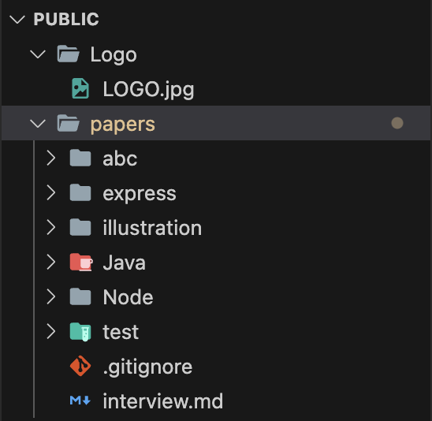
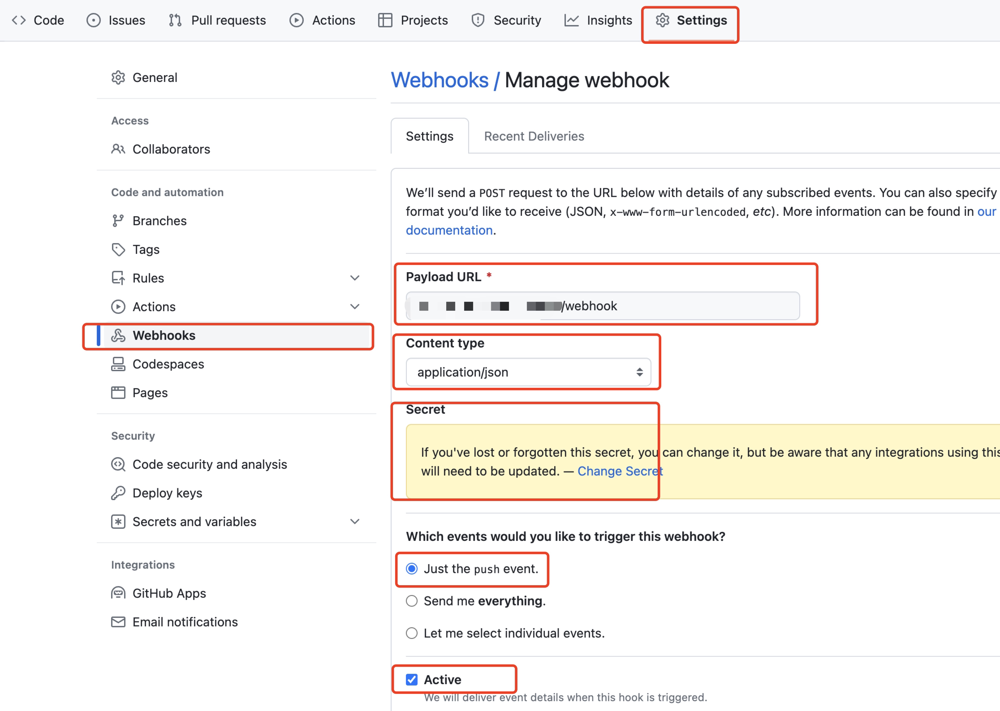

## 0. 介绍

+ 博客文章展示网站

## 1. 启动项目

```
npm run start
// 或者
npm run dev
```

> 如果启动后运行提示文件路径无法找到，请按照 3. 中介绍配置文章文件目录，并手动执行http://192.xxx.xx.xxx:8888/updateDirectoryTree 方法生成目录数据。
> 可将文章配置至github，并配置github webhook（详见4.）。监听每次push，系统会在 push 后自动拉取并生成结构文件。

## 2. 配置文件
+ **服务器地址 & md文件跟目录** src -> app -> config.js
+ **常量** src -> constant -> index.js
+ **git 仓库地址** script -> clone.sh

## 3. public文件夹结构（与项目同级, 用于存放文章很文章相关数据）



+ Logo/LOGO.jpg 首页头像
+ papers md文件 & 插图
  + papers/illustration 图片
+ directory.json 文件目录结构数据

> papers 内文件夹代表分类(可嵌套)  .md 文件代表文章

## 4. github webhook
+ 文件存放在 github 上，通过 github 提供的 webhook 触发后端执行 scripts/pull.sh 文件。将文件拉取到服务器指定位置(参见 2 中配置)。
+ github webhook 配置
  + 访问接口为 http://服务器地址/webhook
  + Secret 中输入自己的密钥 可通过在终端输入 ruby -rsecurerandom -e 'puts SecureRandom.hex(20)' 生成一个高墒字符串。同时将该密钥配置至 src -> app -> config.js 的 GIT_WEBHOOK_TOKEN
  + 